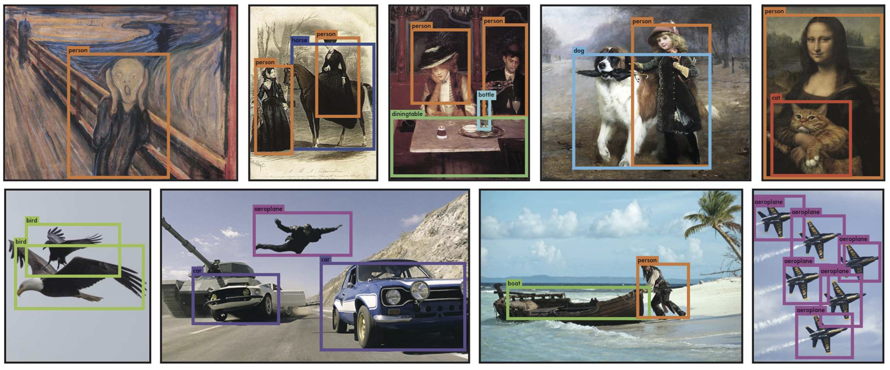
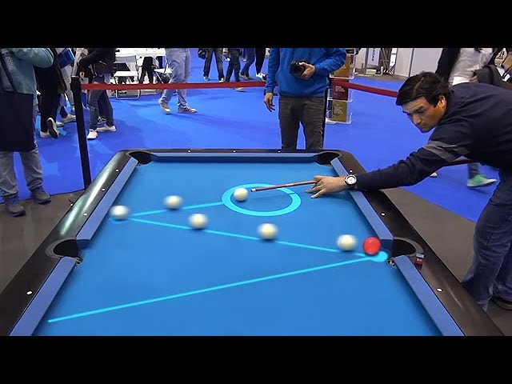

# Scratch
**Purpose:** Scratch is a mobile app for pool players of all levels to track, visualize, and empower their gameplay. 
My hope for this project is to showcase the power of AI as a tool to track pool gameplay. 
In the future I like to enable users to visualize what went wrong and how to improve.

## Scratch V1
We adopted Ultralytics "You-Only-Look-Once" models for real-time pool tracking 

## Scratch V2
Scratch could potentially be used as a visualize cue ball trajectories, i.e. aim assistant 

## Disclaimer
Currently only supported for IOS
